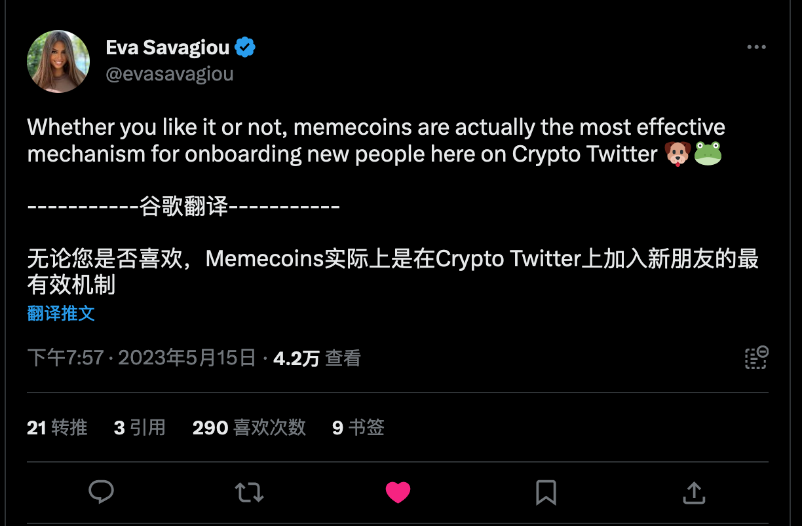

## 扩大影响力的方法论

### 输出别人需要的信息

meme 的例子

- [借助 Memecoin 筹集 690 万美元，加密传奇人物 Ben 是谁？](https://www.theblockbeats.info/news/37028)

## 获取信息的方法论

- [Web3 创作者需要掌握的 10 种信息挖掘策略](https://www.8btc.com/article/6728848)
